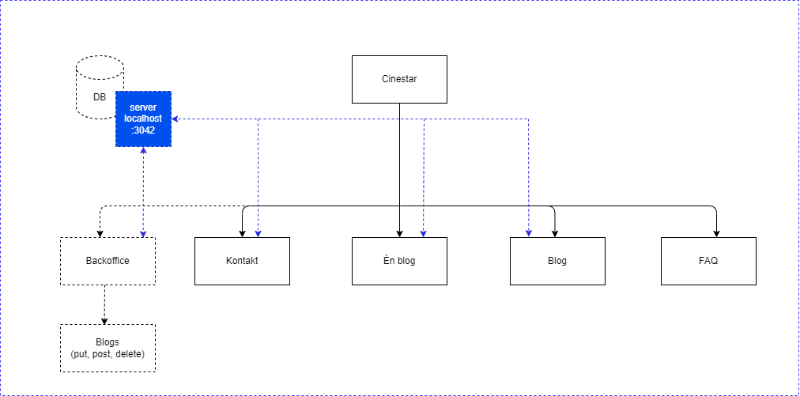

<div style="text-align: center; display: flex; justify-content: center; align-items: center; flex-direction: column; height: 30vh">

# FAGPRØVE

## April 2025

### Webudvikler-uddannelsen<br>Medieskolerne / Media College Denmark

</div>

<div style="page-break-after: always;"></div>

```

Project : Cinestar Studio
Description : Kravspecifikation

```

# Cinestar Studio

Et film- og TV selskab

## Indledning

Cinestar Studio er en innovativ virksomhed, der specialiserer sig i at skabe
professionelle film- og tv-produktioner. Deres mål er at bringe historier til
live gennem levende billeder, der fanger og engagerer publikum. Fra idéudvikling
til det færdige produkt leverer Cinestar Studio løsninger, der gør kundernes
fortællinger uforglemmelige.

Udover deres kreative arbejde ønsker Cinestar Studio at dele deres viden og
inspiration med omverdenen gennem en blog. Her kan deres ansatte poste artikler
om deres projekter, kreative processer og nye trends i branchen. Bloggen skal
være en central del af deres digitale platform og fungere som en kilde til
indsigt og inspiration for både kunder og branchefolk.

## Obligatoriske Opgaver.

1. Mobile first frontend i forhold til figma-designet.
2. Forside
   - "Vores seneste blog": Visning af den senest oprettede blog (fra api'et)
   - "Hvad siger vores samarbejdspartnere om os?": Viser reviews/kundeudtalelser
     (fra api'et).
3. Blog
   - Viser alle blogindlæg (fra api'et) og navigerer til detaljesiden
4. Enkelt visning/detaljeside (blog)
5. FAQ
6. Kontakt
   - Formular med validering der sender navn, emne og beskrivelse til serveren
     samt modtager responset derfra.
7. Backoffice (Ikke mobil krav).
   - Blogs
     - Post, Put, Delete

## Minimum 1 Tilvalg

1. Responsive breakpoint > 1024px.
2. Backoffice
   - Messages (Vis de beskeder der er sendt via kontaktformularen)
     - Read/unread
3. Backoffice
   - Reviews
     - Post, Put, Delete
4. Authentication
   - Sign In

## Navigations Diagram



Du skal ikke følge denne slavisk men den er tilføjet for at illustrere
hensigten.

## Obligatoriske sider

1. "/"
2. "/blog"
3. "/blog/:id"
4. "/contact"
5. "/faq"
6. "/backoffice"
7. "/backoffice/blogs"

## Tilvalgs Sider

1. "/backoffice/reviews"
2. "/backoffice/messages"

## Design Noter

**Design**

Du skal følge dette Figma-design:

- https://www.figma.com/design/aQbaOdQIJGJpy2Zg96s2Bh/Cinestar?node-id=0-1&t=p5Jt10O1WhRJtPFN-1

**Font**

1. Cormorant: https://fonts.google.com/specimen/Cormorant?query=cormorant

2. Quicksand: https://fonts.google.com/specimen/Quicksand?query=quicksand

## Rapport

**Rapporten skal indeholde:**

- Vurdering af din egen indsats og gennemførelse af prøven.
- Argumentation for de valg du har truffet under løsningen af opgaven.
- Redegørelse for oprindelsen af de forskellige kodeelementer i prøven.
- Beskrivelse af eventuelle særlige punkter til bedømmelse.
- Angivelse af url adresser, brugernavne og passwords der er nødvendige for at
  lærer og censor kan se opgaven. Hvis du bruger et agilt projektstyringsværktøj
  (SCRUM, Trello eller lign.) kan du med fordel indsætte et link til dit projekt
  i rapporten. Vi vil meget gerne se en daglig planlægning og eksekvering.

**På forsiden af rapporten skal fremgå:**

- Opgavens navn samt dit navn og holdnummer
- Brugernavn/adgangskoder

<div style="page-break-after: always;"></div>

## Retningslinjer

**Tidspunkt for udlevering**

Opgaven udleveres mandag d. 31/3 kl. 9.00.

**Tidspunkt for aflevering**

Din aflevering skal være afleveret fredag d. 4/4 kl. 20.00.

**Aflevering skal godkendes**

Din aflevering skal godkendes af din underviser.

**Aflevering skal indeholde**

1. Din kildekode (js, css, html, package.json, osv.), alt hvad du benytter for
   at lave projektet.
2. En instruktion i form af en readme.md, der beskriver hvad der skal til for at
   starte projektet.
3. En rapport. (pdf, eller .md (Mark Down)).

**Afleveringsformat**

1. Du kan aflevere det hele i en samlet zip fil uden ”node_modules”.
2. Du kan aflevere det hele som et GIT repositorie.

Tal med din underviser, og forbered gerne begge dele.

**Mundtlig eksamination**

Under eksaminationen skal du præsentere din opgaveløsning. Derudover skal du
kunne redegøre for enkeltelementer af løsningen - Dette kan være spørgsmål
omkring koder, valg af metodikker, navigationselementer, databaselayout eller
lignende. Udover projektopgaven kan øvrige emner, der relaterer sig til
uddannelsens fagområde indgå i eksaminationen.

**På dagen for eksamen**

På selve eksamensdagen ankommer du til skolen i god tid, før eksaminator og
censor har skuetid på din projektløsning. Projektet afvikles fra din egen
maskine, der bliver forbundet til en større skærm via HDMI (Tjek hjemmefra at
forbindelsen virker). Hvis ikke du medbringer strømforsyning, skal du sørge for
at maskinen er fuldt opladet og at den ikke låser med kode efter få minutter.
Fjern alt fra skrivebordet som er uvæsentlig for eksamen, og klargør programmer
og browser med projektet tændt. Du bliver inviteret ind i eksamenslokalet
kortvarigt for at opsætte din maskine, og skal derefter forlade lokalet under
skuetiden. Ved skuetids ophør bliver du hentet ind i lokalet igen, og skal
begynde din præsentation af projektet. Du har ca. 25 minutters eksamenstid,
hvorefter du skal forlade lokalet, mens eksaminator og censor voterer.
Slutteligt vil du blive kaldt ind i lokalet, og mundtligt få udleveret din
karakter samt en kort forklaring af karakteren. Utilfredshed med karakteren skal
ikke diskuteres ved overdragelsen af karakteren, men kan klargøres i en
skriftlig klage over karakteren eller formen ved eksamen eller karakterens
afgivelse.

**Klager**

Klager i forhold til eksamen modtages indtil 2 uger efter eksamenstidspunktet,
og kun i skriftlig begrundet form.
https://www.retsinformation.dk/eli/lta/2014/41#Kap10

**Vejledning**

Det er tilladt at kontakte undervisere i forbindelse med vejledning.
Undervisere, må ikke, i forbindelse med tvivl eller lign., aflevere løsninger
men må gerne vejlede.
